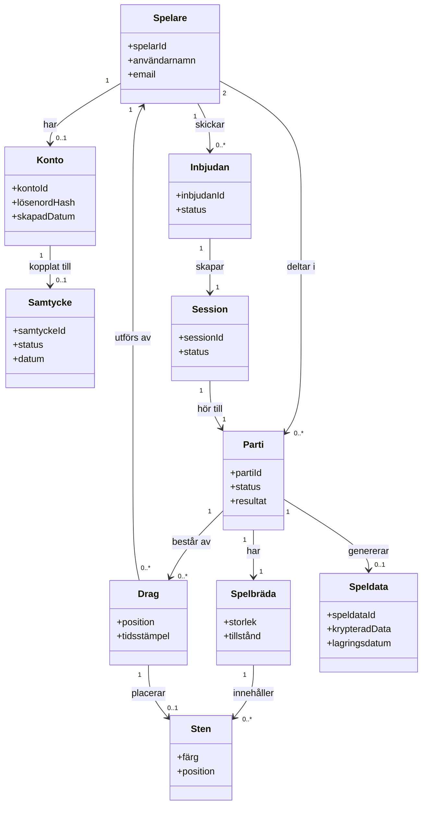

# Begreppsmodell – Gomoku

*Mermaid kod genererad baserad på spelets flöde.
Begrepp använda från Glossary, taget från krav + diverse UC*

Denna begreppsmodell visar aktörer och begrepp i Gomoku, samt hur de relatrerar.
För tydligare förklaring gällande begreppen så kika på [våran Glossary :)](00-Glossary.md) 

## Kommentarer till modellen

- **Spelare –> Konto:** en spelare kan delta anonymt/gäst i vissa flöden, men behöver ett konto för att spara framsteg (kopplat till FK-09).
- **Spelare –> Parti:** varje parti kräver exakt två deltagare (FK-01, FK-05), medan en spelare kan delta i flera partier över tid.
- **Inbjudan –> Session:** en inbjudan resulterar i en session som motståndaren kan gå med i (FK-04, FK-05).
- **Parti –> Speldata:** speldata genereras och lagras säkert enligt GDPR när partiet spelas eller avslutas (FK-07, IFK-06).
- **Drag –> Spelare:** varje drag kopplas till den spelare som utförde det, och valideras mot spelets regler innan det godkänns (FK-08, IFK-05).
- **Konto –> Samtycke:** krävs för att hantera GDPR-relaterade krav som återkallande av samtycke och dataportabilitet (IFK-07, IFK-08, IFK-09).
.
