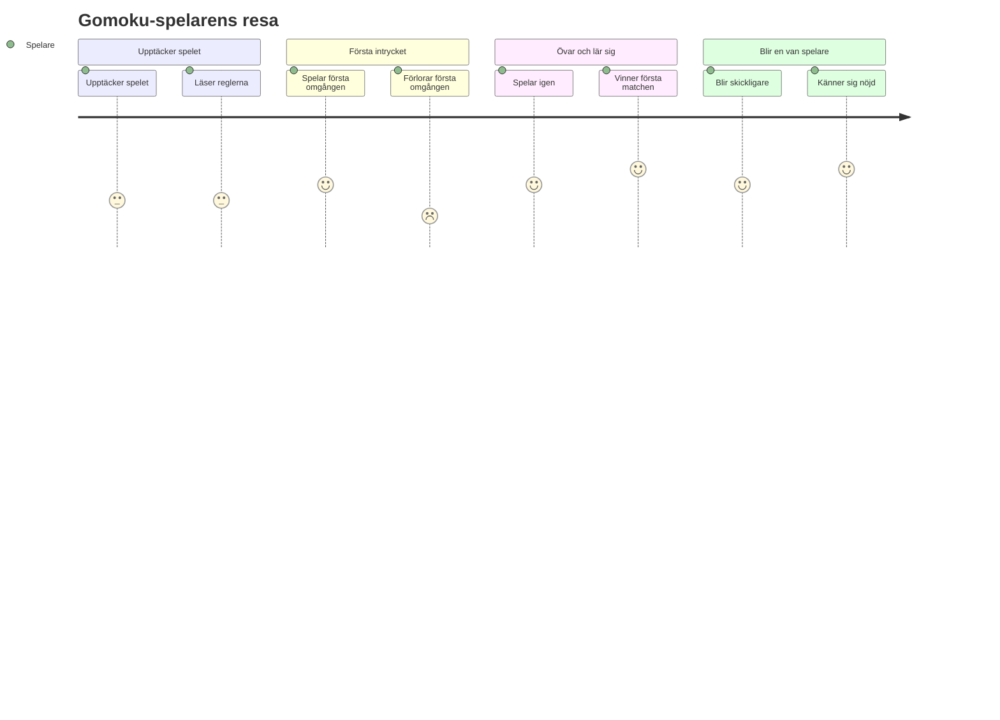
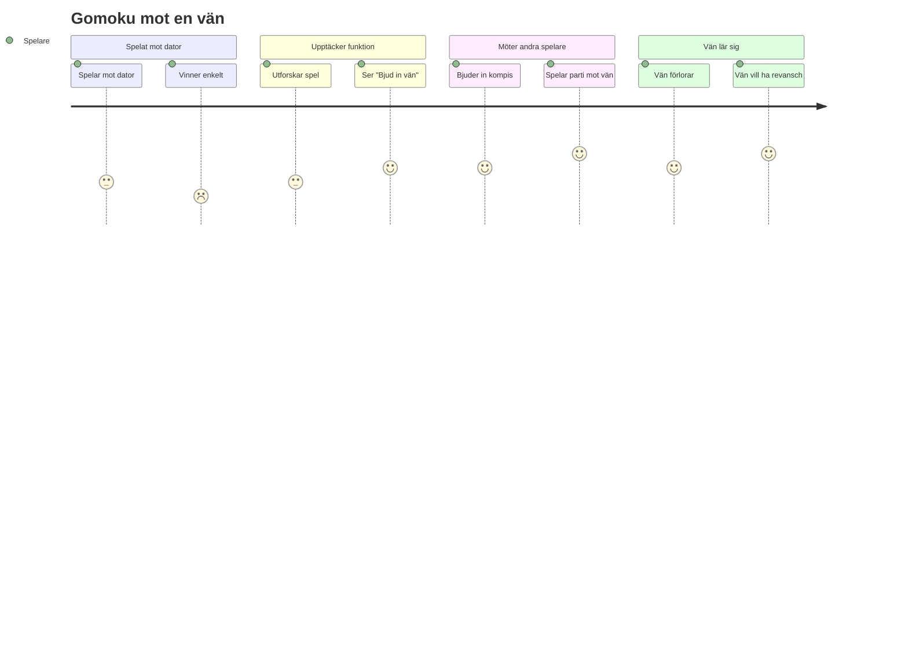

## User Journey

### 1. Ny spelare

```mermaid
journey
    title Gomoku-spelarens resa
    section Upptäcker spelet
      Upptäcker spelet: 3: Spelare
      Läser reglerna: 3: Spelare
    section Första intrycket
      Spelar första omgången: 4: Spelare
      Förlorar första omgången: 2: Spelare
    section Övar och lär sig
      Spelar igen: 4: Spelare
      Vinner första matchen: 5: Spelare
    section Blir en van spelare
      Blir skickligare: 4: Spelare
      Känner sig nöjd: 5: Spelare
```

### 2. Spelare kör första match mot en vän

```mermaid
journey
    title Gomoku mot en vän
    section Spelat mot dator
      Spelar mot dator: 3: Spelare
      Vinner enkelt: 2: Spelare
    section Upptäcker funktion
      Utforskar spel: 3 : Spelare
      Ser "Bjud in vän": 4: Spelare
    section Möter andra spelare
      Bjuder in kompis: 4: Spelare
      Spelar parti mot vän: 5: Spelare
    section Vän lär sig
      Vän förlorar: 4: Spelare
      Vän vill ha revansch: 5: Spelare
```

